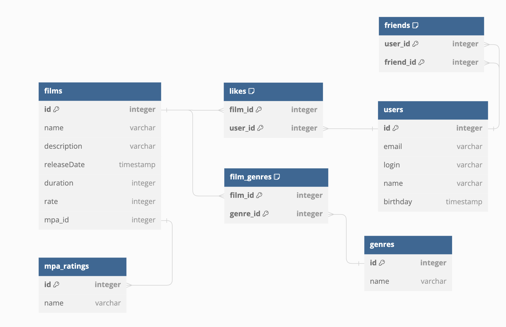

# java-filmorate
Template repository for Filmorate project.

Получение фильма по id 1
SELECT *
FROM films
WHERE id = 1

получение всех фильмов
SELECT *
FROM films

получение фильмов, отсортированных по количеству лайков
SELECT *
FROM films
ORDER BY rating DESC

Получение пользлователя по id 1
SELECT *
FROM users
WHERE id = 1

получение всех пользователей
SELECT *
FROM users

получение всех друзей пользователя c id 1
SELECT * 
FROM users
WHERE id IN (SELECT friend_id
FROM friends
WHERE user_id = 1)

получение общих друзей у пользвателей с id 1 и 2
select film_id
from film_actor
where actor_id = 1
and film_id in (select film_id
from film_actor
where actor_id = 2)

